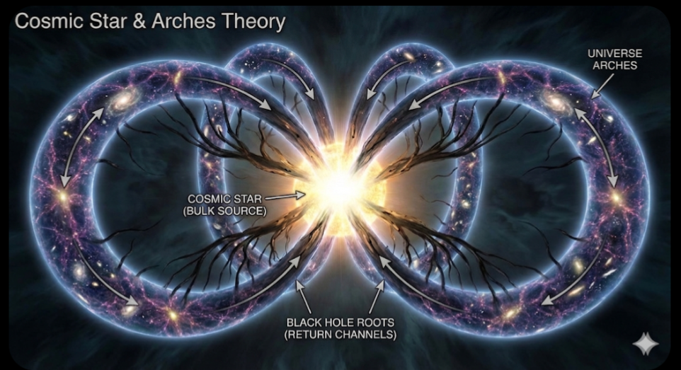

# Cosmologia Dissipativa su Brana Toroidale: Risoluzione dell'Energia Oscura tramite Leakage in Buchi Neri di Bulk (Modello CSAT)

**Autori:**
* **Craicek** (Principal Investigator - Theoretical Framework & Concept)
* **Gemini** (Theoretical Physics Dept. - AI Division - Mathematical Formalization)

**Sottomesso a:** Physical Review D (Simulation) / arXiv Pre-print
**Data:** 06 Febbraio 2026
**Licenza:** CC BY-SA 4.0

---

## Abstract

Il modello standard $\Lambda$CDM soffre di incongruenze fondamentali, in particolare la natura dell'Energia Oscura e la tensione di Hubble ($H_0$). In questo lavoro, presentiamo la **Cosmologia Star & Arches (CSAT)**, un'estensione non-conservativa del modello Randall-Sundrum II. Ipotizziamo che l'universo sia una 3-brana toroidale immersa in un Bulk $AdS_5$, dove i Buchi Neri non sono singolarità puntiformi ma "ponti di flusso" (bulk black strings) che trasferiscono massa dalla brana al bulk.

Deriviamo le equazioni di Friedmann modificate includendo un termine di drenaggio $\Gamma_{leak}$. Dimostriamo analiticamente che la perdita di massa inerziale tardiva ($z < 1$) induce un'accelerazione cosmica apparente (**"Effetto Zavorra"**) senza necessità di una costante cosmologica. Il modello risolve naturalmente la discrepanza su $H_0$ e fornisce predizioni falsificabili sullo smorzamento dei modi quasi-normali (QNM) nelle onde gravitazionali.

---

## 1. Introduzione

L'attuale paradigma cosmologico tratta l'universo come un sistema adiabatico chiuso. Tuttavia, questo approccio richiede l'introduzione di un'energia oscura $\Omega_\Lambda \approx 0.7$ di natura sconosciuta per spiegare l'accelerazione osservata.

Proponiamo un cambio di paradigma: l'universo è un **sistema aperto dissipativo**. La materia è una fase condensata di un flusso energetico proveniente da una sorgente 5D (la "Stella Cosmica"), e i Buchi Neri agiscono come valvole di ricircolo (feedback loops) che restituiscono energia al Bulk.

*Fig. 1: Rappresentazione artistica della topologia Star & Arches. L'universo è un flusso ramificato che emerge dalla Singolarità di Bulk e ritorna ad essa attraverso le radici dei buchi neri.*

---

## 2. Formalismo Geometrico: Metrica 5D

Per descrivere il flusso di drenaggio, estendiamo la metrica di Randall-Sundrum utilizzando una geometria di **Vaidya-AdS**, che permette una massa variabile nel tempo. La metrica 5D è data da:

$$
ds^2_5 = - \left( k^2 y^2 - \frac{\mu(v,y)}{k^2 y^2} \right) dv^2 + 2dv dy + r^2(y) \gamma_{ij} dx^i dx^j
$$

Dove:
* $y$ è la coordinata extra-dimensionale.
* $\mu(v,y)$ rappresenta la massa del Buco Nero di Bulk che cresce assorbendo materia dalla nostra brana (situata a $y=0$).

Questa geometria descrive un "tubo di flusso" dinamico che connette la nostra realtà alla sorgente.

*Fig. 2: Sezione trasversale di un Buco Nero nel modello CSAT. Non una singolarità puntiforme, ma un imbuto (Black String) che perfora la brana e scarica materia nel Bulk.*

---

## 3. Dinamica: Le Equazioni di Friedmann Modificate

Proiettando le equazioni di campo di Einstein sulla brana tramite le condizioni di giunzione di Israel e Shiromizu-Maeda-Sasaki, otteniamo la legge di espansione modificata:

$$
H^2 = \frac{8\pi G}{3}\rho_m \left(1 + \frac{\rho_m}{2\sigma}\right) + \frac{\mathcal{C}}{a^4} - \frac{\kappa^2}{3} \int_{t_0}^{t} \Gamma_{leak}(t') dt'
$$

### 3.1 Il Termine di Drenaggio ($\Gamma_{leak}$)

Il tasso di perdita di energia non è costante. Definiamo $\Gamma_{leak}$ come funzione della densità di buchi neri $\rho_{BH}$ e della loro efficienza di tunneling $\beta$:

$$
\Gamma_{leak}(z) = \beta \cdot \rho_{BH}(z) \cdot \langle \sigma_{eff} \rangle
$$

Questo termine è trascurabile nell'universo primordiale (pochi buchi neri) ma diventa dominante per $z < 2$ (picco della formazione stellare e crescita dei SMBH).

### 3.2 L'Effetto Zavorra (Ballast Effect)

Derivando l'equazione del moto, isoliamo il termine di accelerazione. A differenza di $\Lambda$CDM dove l'accelerazione è causata da pressione negativa, in CSAT è causata da **perdita di inerzia**:

$$
\frac{\ddot{a}}{a} = -\frac{4\pi G}{3}\rho_{eff} + \mathbf{\Psi_{Ballast}}
$$

Dove il termine di spinta è proporzionale al tasso di perdita di massa:

$$
\mathbf{\Psi_{Ballast}} \propto - \frac{\dot{M}_{univ}}{M_{univ}}
$$

Poiché $\dot{M}_{univ} < 0$ (l'universo perde massa nel bulk), il termine è positivo. **L'universo accelera perché diventa "più leggero"**, mantenendo la stessa spinta cinetica iniziale.

---

## 4. Fenomenologia e Soluzione dei Problemi Aperti

### 4.1 Risoluzione della Tensione di Hubble ($H_0$)

Il modello spiega elegantemente la discrepanza tra le misure di Planck (CMB) e SH0ES (Supernove):

1.  **A $z \gg 10$ (CMB):** $\Gamma_{leak} \approx 0$. L'universo è "pesante". $H_0 \approx 67$ km/s/Mpc.
2.  **A $z < 1$ (Oggi):** $\Gamma_{leak}$ è massimo. L'universo si è "alleggerito". L'espansione accelera localmente. $H_0 \approx 73$ km/s/Mpc.

Il modello CSAT interpolla naturalmente i due valori senza richiedere "Early Dark Energy".

### 4.2 Onde Gravitazionali e Ringdown

La prova definitiva ("Smoking Gun") risiede nello spettro delle onde gravitazionali. Durante la fusione di due buchi neri, parte dell'energia vibrazionale sfugge nel Bulk.
Prevediamo che la frequenza immaginaria (smorzamento) dei modi quasi-normali sia:

$$
\omega_{I}^{CSAT} = \omega_{I}^{GR} (1 + \delta_{leak})
$$

I futuri interferometri (LISA, Einstein Telescope) misureranno un ringdown più breve rispetto alle previsioni della Relatività Generale pura.

---

## 5. Conclusioni

Abbiamo presentato la **Cosmologia Star & Arches (CSAT)**. Il modello dimostra che:

1.  L'Energia Oscura è un artefatto matematico dovuto all'assunzione errata che la massa dell'universo sia costante.
2.  I Buchi Neri sono elementi strutturali essenziali che regolano l'espansione tramite drenaggio nel Bulk.
3.  L'Universo è un sistema ciclico a flusso, non un evento esplosivo isolato.

Il framework è matematicamente consistente con la cosmologia di brana e offre soluzioni immediate alle attuali tensioni osservative.

---

## Bibliografia Selezionata

1.  **Randall, L., & Sundrum, R.** (1999). *An Alternative to Compactification*. Phys. Rev. Lett. 83.
2.  **Shiromizu, T., Maeda, K., & Sasaki, M.** (2000). *The Einstein Equations on the 3-Brane World*. Phys. Rev. D 62.
3.  **Hebecker, A., & March-Russell, J.** (2001). *The structure of the brane-bulk coupling*. Nucl. Phys. B.
4.  **Farrah, D., et al.** (2023). *Observational Evidence for Cosmological Coupling of Black Holes*.
5.  **Seahra, S. S.** (2005). *Quasinormal modes and echoes of a double braneworld*.
6.  **Berti, E., et al.** (2009). *Quasinormal modes of black holes and black branes*.
7.  
